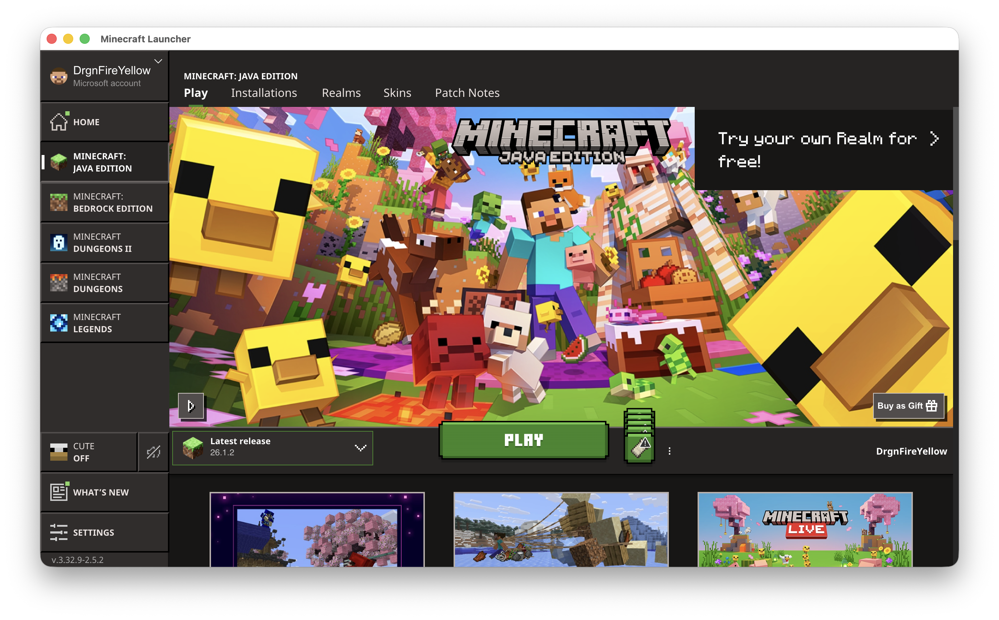
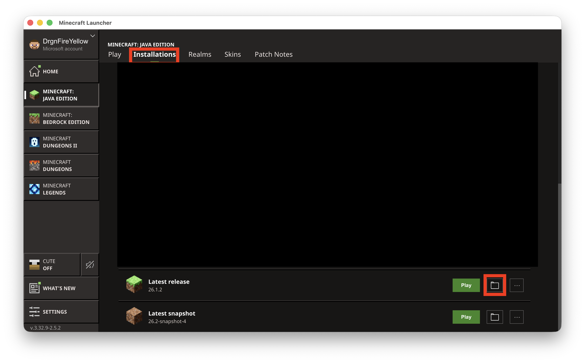

# Clean-Up Crew Installation
1. [Download the world](https://github.com/DrgnFireYellow/Cleanup-Crew/archive/refs/heads/main.zip) and unzip it
2. Open the Minecraft launcher and select Minecraft: Java Edition

3. Navigate to the Installations tab and click the folder icon next to "Latest Release", this will open your Minecraft folder.

4. Open the "saves" folder and move the unzipped world there.
5. Launch the game, select "Singleplayer", and load the world!
